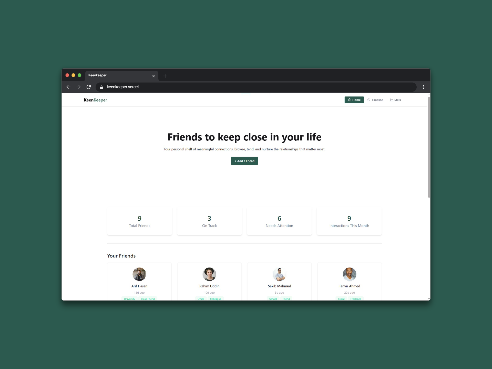
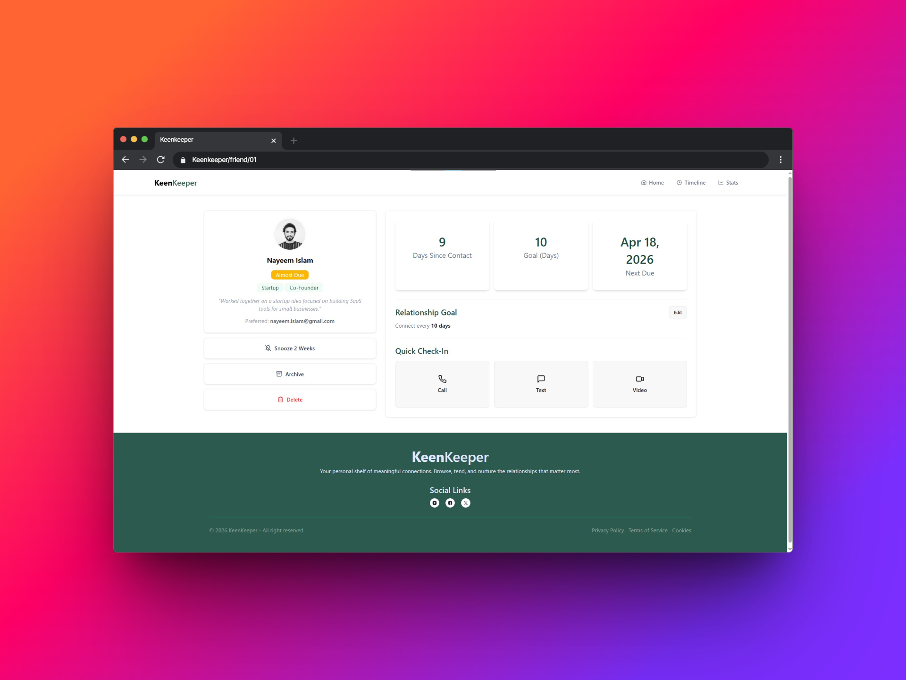
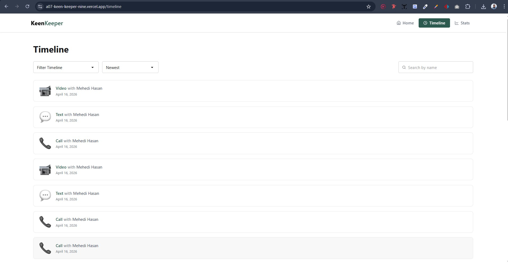
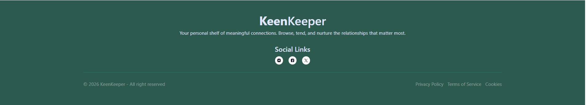
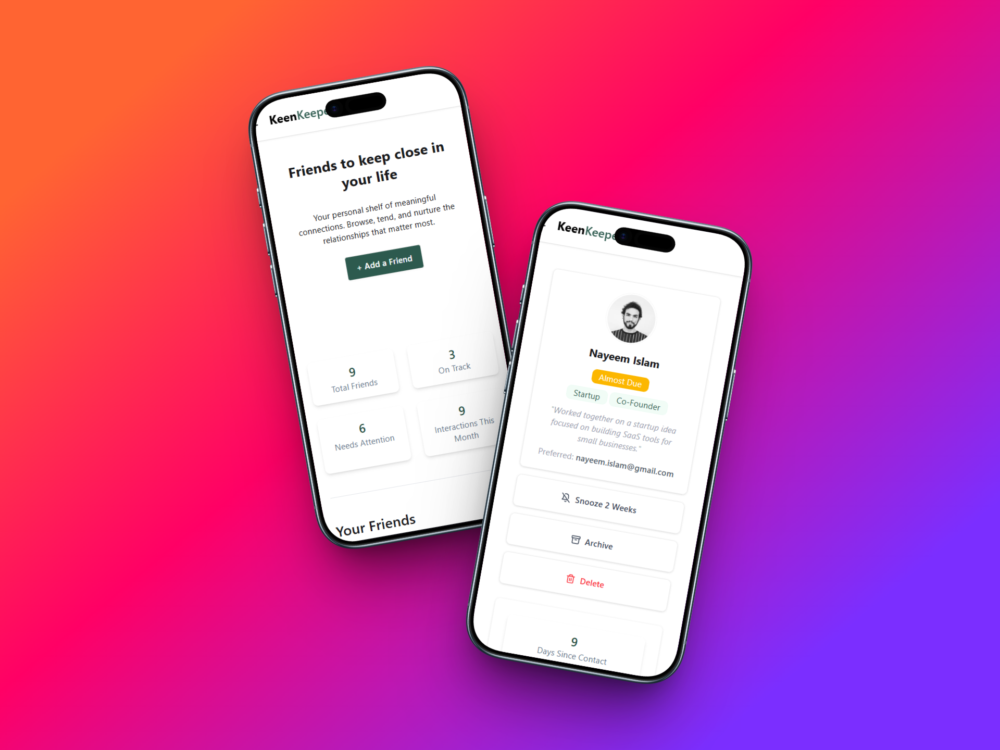

# 🤝 

> **Your personal shelf of meaningful connections.**  
> Browse, tend, and nurture the relationships that matter most.

[](https://nextjs.org/)
[](https://react.dev/)
[](https://tailwindcss.com/)
[](https://daisyui.com/)
[](https://a07-keen-keeper-nine.vercel.app)

---

## 📖 About

**KeenKeeper** is a personal relationship management dashboard built with Next.js. It helps you keep track of the people in your life — friends, family, and colleagues — by giving you a clean, organized view of your connections, interaction history, and relationship health at a glance.

Think of it as your personal CRM, but designed for real human relationships, not sales pipelines.

---

## 💡 Why KeenKeeper?

In today’s fast-paced world, we often get busy and unintentionally lose touch with people who matter the most — friends, family, and meaningful connections.

KeenKeeper is built to solve that.

It’s not just about tracking interactions — it’s about being intentional with relationships.  
This project helps you stay connected, remind yourself who needs attention, and build stronger, long-lasting human connections.

Because relationships deserve the same care and structure we give to our work.

---

## ✨ Key Features

### 👥 Friend Dashboard with Status Tracking

View all your connections in a beautiful 4-column responsive grid. Each friend card shows their last interaction date, relationship tags (Work, Family, Hobby, Travel), and a color-coded status badge — **On Track**, **Overdue**, or **Action Due** — so you always know who needs your attention.

### 📊 At-a-Glance Stats

A summary panel at the top shows your total friends count, how many are on track, how many need attention, and your total interactions this month — giving you a quick pulse check on your social life without digging through details.

### 🔍 Detailed Friend Profiles via Modal

Click on any friend card to Open a smooth, non-disruptive modal experience that lets you explore detailed profiles without navigating away — ensuring a seamless user flow with their complete profile — including labels, priority level, assignee info, and important dates — all without leaving the page.

---

## 🛠 Tech Stack

| Technology                                                  | Version | Purpose                   |
| ----------------------------------------------------------- | ------- | ------------------------- |
| [Next.js](https://nextjs.org/)                              | 16.2.3  | React framework & routing |
| [React](https://react.dev/)                                 | 19.2.4  | UI library                |
| [Tailwind CSS](https://tailwindcss.com/)                    | v4      | Utility-first styling     |
| [DaisyUI](https://daisyui.com/)                             | v5      | UI component library      |
| [React Icons](https://react-icons.github.io/react-icons/)   | v5      | Icon library              |
| [React Toastify](https://fkhadra.github.io/react-toastify/) | v11     | Toast notifications       |
| [Recharts](https://recharts.github.io/)                     | v3.8.1  | Toast notifications       |

---

## 🧠 What I Learned

While building **KeenKeeper**, I focused on both technical and product-level thinking:

- ⚛️ Built a modern app using **Next.js** App Router (Server + Client Components)
- 🔄 Managed global state using React **Context API**
- 🎯 Designed reusable and scalable UI components
- ⚡ Implemented loading UI for better user experience
- 📊 Processed and visualized dynamic data using _Recharts_ (status tracking & interaction metrics)
- 🎨 Improved UI/UX using Tailwind CSS and DaisyUI
- 🧩 Learned how to structure a real-world project professionally

This project helped me move beyond just coding — into building meaningful user-focused applications.

---

## 🚀 Getting Started

### Prerequisites

- Node.js 18+
- npm or yarn

### Installation

```bash
# Clone the repository
git clone https://github.com/shahadat-hossain99/a07-keen-keeper.git

# Navigate into the project
cd a07-keen-keeper

# Install dependencies
npm install

# Start the development server
npm run dev
```

Open [http://localhost:3000](http://localhost:3000) in your browser to see the app.

---

## 📁 Project Structure

```
a07-keen-keeper/
├── public/          # Static assets
├── src/
│   └── app/         # Next.js App Router pages & components
├── package.json
├── next.config.mjs
└── tailwind.config  # Tailwind + DaisyUI config
```

---

## 🌐 Live Demo

🚀 Experience the app in action:

👉 **[a07-keen-keeper-nine.vercel.app](https://a07-keen-keeper-nine.vercel.app)**

💡 Try this:

- Open a friend profile
- Check status badges (On Track / Overdue)
- Explore how interaction tracking works

_(GIF demo coming soon for a smoother preview 👇)_

---

## 📸 Screenshots

### 🖥️ Home



### 📋 Friend Details



<!-- ### 📋 Timeline Page



### 📋 Footer

 -->

### 📱 Mobile View



---

## 👨‍💻 Author

**Md. Shahadat Hossain**  
Frontend Developer | React & Next.js Learner

[](https://github.com/shahadat-hossain99)
[](https://www.linkedin.com/in/md-shahadat-hossain-coder)

---

## 📄 License

This project is open source and available under the [MIT License](LICENSE).

---

<p align="center">Made with ❤️ by Shahadat Hossain</p>
